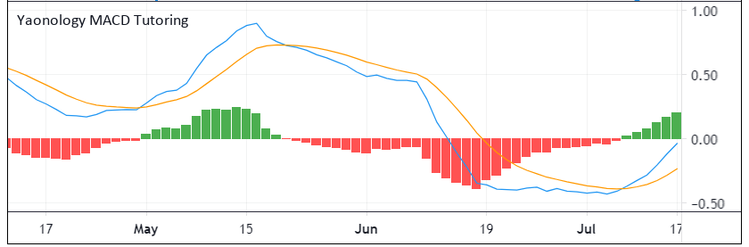
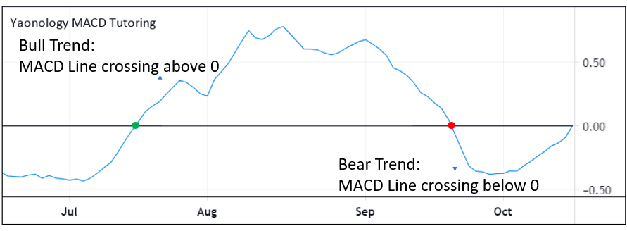
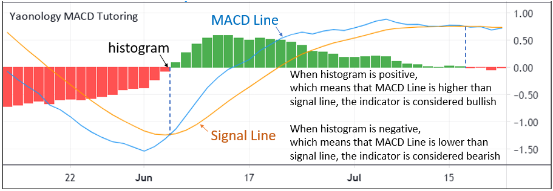
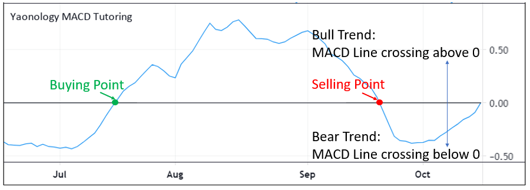
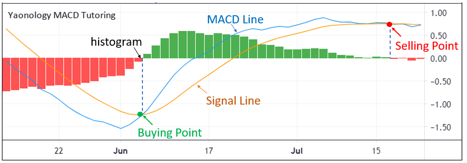

# MACD

## 1. What is the MACD Index?

Moving Average Convergence Divergence (MACD) is a trend-following momentum indicator that shows the relationship between two moving averages of a security's price 

The MACD line is calculated by subtracting the 26-period Exponential Moving Average (EMA) from the 12-period EMA

The signal line is the exponential moving average of MACD line within 9-period

The histogram is the MACD line minus signal line



Formula:

(1) MACD Line = fast_ema - slow_ema
    fast_ema = ema(close, 12)
    slow_ema = ema(close, 26)
    
(2) Signal Line = ema(macd, 9)

(3) hist = MACD Line - Signal Line

## 2. What does the MACD tell you? 

### · MACD Line Bull/Bear Trend

MACD is a lagging indicator since it is based on historical data. If the MACD line crosses above 0, it is highly likely to be a bull market. And when it crosses below zero, the market tends to be bearish.



### · Histogram Bull/Bear Trend

But the MACD histogram is sometimes considered a leading indicator, as it is used to anticipate signal crossovers in between the MACD line and the signal line. The bars on the histogram represents the difference between the two MAs – as the bars move further away from the central zero line, it means the MAs are moving further apart.

Therefore, when the histogram is positive which means the MACD line is higher than the signal line, the indicator is considered bullish. However, when the histogram is negative which means that the MACD line is larger than the signal line, the indicator is considered bearish.



## 3.  MACD Strategy

There are some MACD strategies based on the above theory.

### · MACD Line Bull/Bear Trend

The MACD line crosses above zero which is a signal of bull trend, therefore, we can buy at the point.  

And if the line crosses below zero which is a signal of bear market, the future trend tends to decline and we should sell at this point.



### · Histogram Bull/Bear Trend(MACD Line and Signal Line Crossover and Crossunder)

From the histogram we can also form a strategy that utilizes the crossover of MACD line and Signal Line. If the bar in the histogram turns from negative to positive which means the MACD line becomes higher than the signal line, we need to buy. 

If the bar turns from positive into negative which means the MACD line becomes lower than the signal line, we need to sell. 



## 4. Tradingview Pine Script

### · Step One: Initial Setting

(1) Step one initial setting is the step we set up the strategy property, which includes “Strategy ID”, “The plot overlays the main chart or show on the separate chart pane. ”, “How much is the initial capital”, “How many percentages of capital buying the equity?”, “How much is commission fee”

(2) First, we need to set up the Pine Script version. Here, we are using the last version, version four.

(3) Then, we start to code the strategy property. The double quote we type “Yaonology MACD Indicators Tutoring”, which is the strategy id.

(4) “overlay equals true” means that the plot overlays the main chart. On the other hand, if “overlay equals false”, it means that the plot will show on the separate chart pane.

(5) Then, we set up the initial capital, here, we code “initial_capital equals 10000” and “currency = currency.USD”, which means that we are using US$10000 as the initial capital

(6) Then, we need to determine how many shares we trade equities. Here, we code “default_qty_type equals strategy.percent_of_equity” and “default_qty_value equals a hundred”, which means that we are using the percentage type to trade the equity, and we use 100 percent of capital to trade the equities.

(7) Finally, we set up the commission fee. Here, we code “commision_type equals strategy.commission.percent” and “commission_value = 0”, which means that we use the percentage type to calculate the commission fee, and here we set up 0% commission fee because most brokers don’t charge the commission fee currently.

```
//Step One: Initial Setting
//@version=4
strategy("Yaonology MACD Tutoring", overlay = true, currency = currency.USD, initial_capital = 10000, default_qty_type = strategy.percent_of_equity, default_qty_value = 100, commission_type = strategy.commission.percent, commission_value = 0)
```

### · Step Two: Parameter Setting

(1) Step Two Parameter Setting is the step we set up the MACD parameter

(2) The macd has been of a built-in Function in Pinescript to calculate the macd line.  Close means the close price.  

(3) Here, we calculate the macd line using the 12 periods, signal Line as 26 periods, and histline as 9 periods.

(4) Therefore, “macdline” means the macd  line in the past 12 periods. 
“signalLine” means the signal line in the past 26 periods. 
“histLine” means the histogram in the  9 periods.

```
//Step Two: Parameter Setting
[macdLine, signalLine, histLine] = macd(close, 12, 26, 9)
```

### · Step Three: Plotting
(1) Step Three Plot is the step that we plot the MACD line, signal line and histogram on the main chart series.

(2) The plot function can plot a series of data on the chart. “histLine” is what data series we want to plot. “Style equals to plot.style_column” means that we plot histline in vertical bars. “Colors equals “ goes with the conditional format that we set. Here, it means if the histLine is larger or equal to zero, then we set the color equal to green,  otherwise, the color is red. 

(3) The “macdLine” is what data series we want to plot. “Color equals color.blue” means that we plot “macdLinet” as a blue color.

(4) We plot the signalLine data series and plot it with the orange color as well.

```
//Step Three: Plotting
plot(histLine, style = plot.style_columns, color = histLine >= 0 ? color.green : color.red) 
plot(macdLine, color = color.blue) 
plot(signalLine, color = color.orange) 
```

### · Step Four: Strategy Entry and Strategy Close

#### MACD Line Bull/Bear Trend

(1) Step Four Strategy Entry and Strategy Close is the step that we set up a condition to buy equity and sell the equity.

(2) Script “If” is the function of what block of statements must be executed when conditions of the expression are satisfied. Here, the statement is “crossover(macdLine, 0) ”, which means that the MACD line crosses above zero.

(3) If the statement is true, the script will execute the next line strategy.entry

(4) “Strategy entry” is the command to enter a market position. How many capitals and how much percentage we have set in Step One. Here, we need to give it an id to identify the entry order, and we give it “macd”. “Long equals true” means that this order is a long position.

(5) A long position means that the purchase of an asset with the expectation it will increase in value.

(6) On the other hand, “Long equals false” means that the order will become a short position that means the purchase of an asset with the expectation it will decrease in value.

(7) Then, we set up the close order. We also give the “if” statement ““crossunder (macdLine, 0)” , which means that the MACD line crosses below zero.

(8) If the statement is true, it will execute the next line strategy.close

(9) “Strategy.close” is the function that a command to exit from the entry with the specified ID. Here, we want to need to close the order, which id is “macd”

```
//Step Four: Strategy Entry and Strategy Close
//MACD Line Bull/Bear Trend
if crossover(macdLine, 0)
    strategy.entry("macd", long = true)

if crossunder(macdLine, 0)
    strategy.close("macd")
```
(10)  Here, we click the “Add to chart” to run the backtesting report.

(11) The net profit is positive 127.04%, which means that this MACD line  strategy can make a profit.

|  | **Net Profit** | **Precent Profitable** | **Profit Factor** | **Max Drawdown** | 
| --- | --- | ---| --- | --- |
| **MACD Line Bull/Bear Trend** | 127.04% | 40.54% | 1.497 | 26.26% |

#### Histogram Line Bull/Bear Trend

(1) If we want to use histLine to make strategy, we simply change the “if” statement as “crossunder(histLine,0) “, straetgy.entry..

(2) Then, “if” statement as “crossover(histLine,0)”, strategy.close.

```
//Step Four: Strategy Entry and Strategy Close
//Histogram Line Bull/Bear Trend
if crossover(histLine, 0)
    strategy.entry("macd", long = true)

if crossunder(histLine, 0)
    strategy.close("macd")
```
(3) We click the “Add to chart” to run the backtesting report.

(4) The net profit is 149.94%, which is much higher than the MACD Line Strategy. Also, the Max Drawdown is 23.96%, which is a bit  lower than the MACD Line Strategy

(5) Therefore, the histogram line strategy can make higher profit and lower risk than MACD line strategy.

|  | **Net Profit** | **Precent Profitable** | **Profit Factor** | **Max Drawdown** | 
| --- | --- | ---| --- | --- |
| **MACD Line Bull/Bear Trend** | 127.04% | 40.54% | 1.497 | 26.26% |
| **Histogram Line Bull/Bear Trend** | 149.94% | 43.92% | 1.389 | 23.96% |

#### Histogram and MACD against the Market

(1) What’s more,  we want to use histogram and MACD against the market to make strategy,which means we buy when the histline cross below zero and the macdline belows zero and sell when the histline cross over zero and the macdline aboves  zero.

In this strategy, we simply change the “if” statement as “crossunder(histLine,0) and macdLine<0”, straetgy.entry..

(2) Then, “if” statement as “crossover(histLine,0) and macdLine>0”, strategy.close.

```
//Step Four: Strategy Entry and Strategy Close
//Histogram and MACD against the Market
if crossunder(histLine, 0) and macdLine < 0
    strategy.entry("macd", long = true)

if crossover(histLine, 0) and macdLine > 0
    strategy.close("macd")
```
(3) We click the “Add to chart” to run the backtesting report.

(4) The net profit is 179.13%, which is much higher than the MACD Line Strategy and the histogram strategy. Also, the Max Drawdown is 21.58%, which is a bit  lower than the MACD Line Strategy and Histogram Line strategy.

(5) Therefore, this”Histogram and MACD against the Market” strategy can make higher profit and lower risk than MACD Line strategy and the Histogram Line Strategy.

|  | **Net Profit** | **Precent Profitable** | **Profit Factor** | **Max Drawdown** | 
| --- | --- | ---| --- | --- |
| **MACD Line Bull/Bear Trend** | 127.04% | 40.54% | 1.497 | 26.26% |
| **Histogram Line Bull/Bear Trend** | 149.94% | 43.92% | 1.389 | 23.96% |
| **Histogram and MACD against the Market** | 179.13% | 86.21% | 4.686 | 21.58% |
